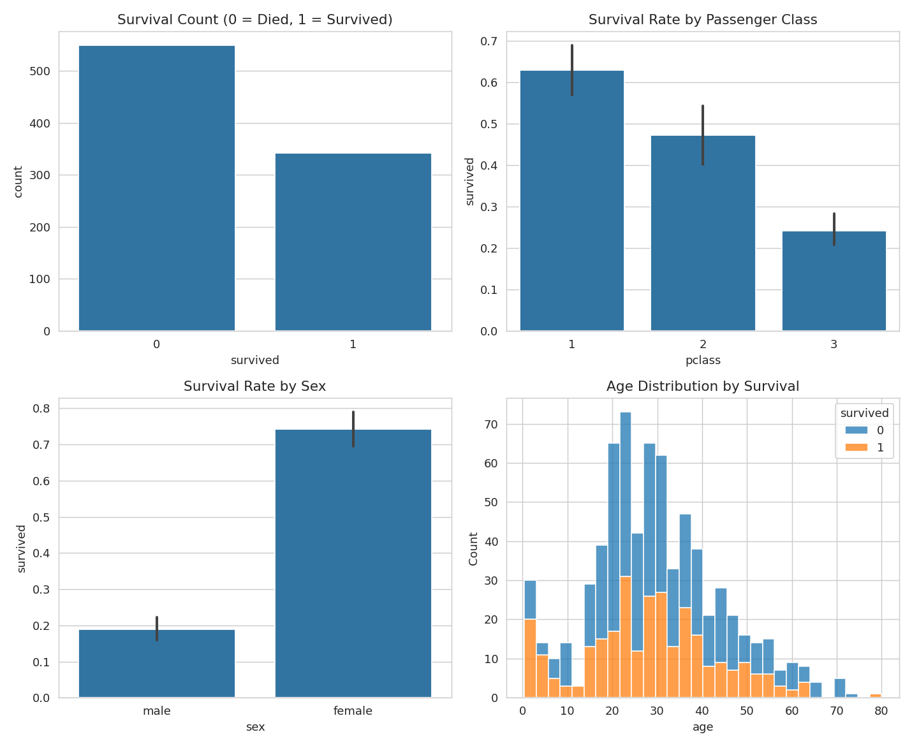
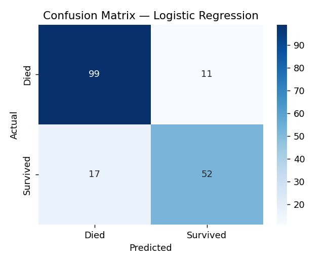
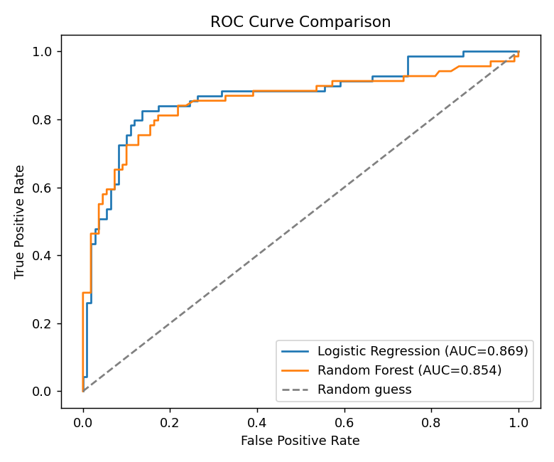

# 🚢 Titanic Survival Prediction

An end-to-end data science project: exploratory data analysis, feature
engineering, model comparison, and a deployed interactive web app that
predicts whether a passenger would have survived the Titanic disaster.

**🔗 Live demo:** _add your deployed Streamlit link here after deployment_



---

## Project Overview

This project walks through a complete data science workflow on the
classic Titanic dataset (891 passengers):

1. **Exploratory Data Analysis (EDA)** — understand survival patterns by
   class, sex, age, and family size
2. **Data Cleaning** — handle missing values (age, embarkation port)
   using grouped imputation rather than naive global averages
3. **Feature Engineering** — derive `family_size`, `is_alone`,
   `fare_per_person`, and `age_band` from raw columns
4. **Model Training** — train and compare Logistic Regression vs.
   Random Forest, with 5-fold cross-validation and grid search
5. **Evaluation** — go beyond accuracy: precision, recall, F1, ROC-AUC,
   confusion matrix, feature importance
6. **Deployment** — an interactive Streamlit app where anyone can enter
   passenger details and get a live prediction

## Results

| Model               | Accuracy | Precision | Recall | F1    | ROC-AUC |
|---------------------|----------|-----------|--------|-------|---------|
| Logistic Regression | 0.844    | 0.825     | 0.754  | 0.788 | 0.869   |
| Random Forest       | 0.821    | 0.814     | 0.696  | 0.750 | 0.854   |

**Logistic Regression was selected** (higher F1 and ROC-AUC, and more
interpretable for explaining individual predictions — important for a
model whose job is to explain *why*, not just predict).




## Key Insights from EDA

- **Sex was the strongest predictor**: ~74% of women survived vs. ~19%
  of men ("women and children first" was real policy, not just a trope)
- **Passenger class mattered almost as much**: 1st class survival ~63%,
  3rd class ~24% — likely driven by cabin location and lifeboat access
- **Being alone hurt survival odds** — passengers traveling with a small
  family (2-4 people) survived more than solo travelers or very large
  families

## Project Structure

```
titanic-project/
├── app/
│   └── app.py                   # Streamlit web app
├── src/
│   ├── eda_and_preprocessing.py # EDA + cleaning + feature engineering
│   └── train_model.py           # Model training, comparison, evaluation
├── data/
│   ├── titanic_raw.csv
│   └── titanic_model_ready.csv
├── models/
│   ├── titanic_model.pkl        # Trained model (Logistic Regression)
│   ├── scaler.pkl               # StandardScaler fitted on training data
│   ├── feature_columns.json     # Exact feature order the model expects
│   └── model_comparison.csv     # Full metrics table
├── assets/                      # Saved plots (EDA, confusion matrix, ROC, etc.)
├── requirements.txt
└── README.md
```

## Running Locally

```bash
# 1. Clone the repo
git clone https://github.com/<your-username>/titanic-survival-prediction.git
cd titanic-survival-prediction

# 2. Create a virtual environment (recommended)
python3 -m venv venv
source venv/bin/activate      # Windows: venv\Scripts\activate

# 3. Install dependencies
pip install -r requirements.txt

# 4. (Optional) Re-run the full pipeline from scratch
python src/eda_and_preprocessing.py
python src/train_model.py

# 5. Launch the app
streamlit run app/app.py
```

The app will open at `http://localhost:8501`.

## Tech Stack

- **Data analysis:** pandas, numpy
- **Visualization:** matplotlib, seaborn
- **Modeling:** scikit-learn (Logistic Regression, Random Forest)
- **Deployment:** Streamlit

## Possible Extensions

- Add XGBoost/LightGBM for comparison
- SHAP values for per-prediction explainability
- Hyperparameter tuning with Optuna instead of GridSearchCV
- Dockerize for deployment outside Streamlit Community Cloud

---

*Built as a learning project to practice the end-to-end data science
workflow: EDA → cleaning → feature engineering → modeling → evaluation → deployment.*
